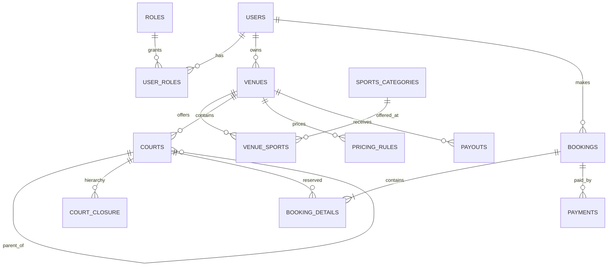

# DALN multi-vendor sports booking platform

## Starting point and implementation boundary

The existing application is a Java 17 / Spring Boot project with Spring MVC, Spring Data JPA, and MySQL. It currently has no booking domain, security configuration, Redis, payment provider, or migrations. `database/schema.sql` is the initial normalized MySQL 8 schema. It is intentionally a standalone DDL deliverable; configure and apply it to a fresh database before mapping JPA entities. Avoid `ddl-auto=update` once schema migrations are adopted.

Recommended next dependencies: Spring Security, Bean Validation, Flyway, Spring Data Redis and Redisson only when multiple application instances need shared locks, and Spring WebSocket/STOMP for owner notifications. Add these in separate steps and configure secrets through environment variables. Use a payment adapter interface with sandbox provider configuration before enabling real payments.

## ERD concepts



`venue_id` on every court and booking detail provides tenant scoping. Every owner/staff query must verify venue membership in the authenticated principal; never trust a client-supplied venue ID alone. `court_closure` stores self links (`depth=0`) and every ancestor/descendant pair. Rebuild it transactionally whenever an administrator changes a court tree. Do not allow cycles, cross-venue parents, or mixed-sport parent-child relationships.

Sports use a category table rather than a Java enum so the platform can add sports without a release. A venue may offer several sports. Each court points to exactly one sport. Pricing rules use venue-local weekday/time and validity dates, with court-specific rules taking precedence over sport-wide rules, then highest priority. Represent holidays as explicit date-specific pricing rules (or add a `venue_holidays` table as that feature is built).

Spatial index supports bounding-box filtering, but calculate exact distance using `ST_Distance_Sphere(location, ST_SRID(POINT(:lng,:lat),4326))` and sort/filter by that distance. Confirm longitude/latitude axis handling with the chosen MySQL connector. Apply a bounding box first to keep the indexed search selective.

## Booking concurrency and hierarchy conflicts

Use InnoDB transactions and pessimistic row locks as the correctness boundary. Redis locks can reduce contention, but must not replace the database transaction and overlap check. A safe hold flow is:

1. Validate customer, venue, court, interval, opening hours, price and idempotency key.
2. Begin `@Transactional`. Fetch all court IDs in the selected court's closure set (selected court, all ancestors and descendants), sort ascending, and lock the `courts` rows in that order with `SELECT ... FOR UPDATE` / `PESSIMISTIC_WRITE`. Stable order reduces deadlocks. Lock all relevant rows before checking availability.
3. Expire stale holds for the affected courts in the same transaction, then search `booking_details` joined to `bookings` for interval overlap (`existing.starts_at < requestedEnd AND existing.ends_at > requestedStart`) where booking status is `HELD`, `PENDING_PAYMENT`, or `CONFIRMED`. Check every locked hierarchy ID. A parent booking conflicts with all descendants, and a child booking conflicts with its parent and siblings in the same physical parent.
4. Insert booking (`HELD`, expiry now + 10 minutes) and details; commit. Return a payment-session instruction. A unique `(customer_id,idempotency_key)` makes retries safe.
5. On successful verified provider webhook, lock booking then payment, require an unexpired hold and valid provider transaction, mark payment `SUCCEEDED`, booking `CONFIRMED`, and clear expiry atomically. Process provider event IDs idempotently. A delayed success after expiry must go to a refund/manual-reconciliation path rather than resurrecting the slot.

An overlap query alone is not enough: without a locked shared row there may be no existing row to lock, so two transactions can both see an empty interval. Locking the hierarchy rows ensures every conflicting parent/child request serializes on at least one common court row. Acquire court locks in sorted ID order and retry deadlock victims a small bounded number of times. A scheduled worker marks expired holds `EXPIRED`; availability must also ignore holds whose `hold_expires_at <= UTC_TIMESTAMP(6)` so scheduler delay never blocks a slot.

Keep transactions short. Do not call a payment provider while holding court locks. Reserve first, commit, then create the provider payment session. If session creation fails, cancel the hold. Store immutable booking price/commission snapshots before introducing payout calculations; the current schema stores unit price and supports dated commission rates, but a production ledger should add booking-level commission snapshots and payout line items.

## REST API contract

All times are ISO-8601 with offset; the server normalizes instants to UTC and renders availability in venue timezone. Money is decimal strings in responses. Require bearer authentication for hold and owner operations. Public reads can be rate limited. Use `ProblemDetail` style errors with `code`, `detail`, and `traceId`.

### `GET /api/v1/venues/search`

Query: `lat`, `lng`, `radiusKm`, optional `sportId`, `date`, `startsAt`, `endsAt`, `page`, `size`.

Example: `/api/v1/venues/search?lat=10.7769&lng=106.7009&radiusKm=8&sportId=2&date=2026-10-03&startsAt=18:00&endsAt=19:00&page=0&size=20`

```json
{
  "items": [{
    "id": 42, "name": "Central Sports", "address": "District 1, HCMC",
    "distanceKm": 2.35, "sports": [{"id": 2, "code": "BADMINTON", "name": "Cầu lông"}],
    "availableCourtCount": 3, "startingPrice": "120000.00", "currency": "VND"
  }],
  "page": 0, "size": 20, "totalItems": 1
}
```

If time filters are supplied, return only venues with at least one available compatible court. Validate radius and coordinate ranges; cap radius and page size.

### `GET /api/v1/venues/{venueId}/availability?date=2026-10-03&sportId=2`

Returns bookable courts and slot states for that local venue date. Slot length is venue/court configuration (add a `slot_minutes` field or venue setting when implementing variable slot lengths).

```json
{
  "venueId": 42, "date": "2026-10-03", "timezone": "Asia/Ho_Chi_Minh",
  "slotMinutes": 60,
  "courts": [{"courtId": 108, "name": "Court 1", "sport": "BADMINTON", "slots": [
    {"startsAt": "2026-10-03T18:00:00+07:00", "endsAt": "2026-10-03T19:00:00+07:00", "status": "AVAILABLE", "price": "120000.00"},
    {"startsAt": "2026-10-03T19:00:00+07:00", "endsAt": "2026-10-03T20:00:00+07:00", "status": "HELD", "price": "150000.00"}
  ]}]
}
```

Availability is advisory; `POST /hold` rechecks under lock. Do not expose another customer's identity or booking code for held slots.

### `POST /api/v1/bookings/hold`

Header: `Idempotency-Key: <opaque-client-generated-key>`.

```json
{
  "venueId": 42, "courtId": 108,
  "startsAt": "2026-10-03T18:00:00+07:00", "endsAt": "2026-10-03T19:00:00+07:00"
}
```

`201 Created`:

```json
{
  "bookingId": 9001, "bookingCode": "DALN-6F82AB", "status": "HELD",
  "holdExpiresAt": "2026-10-03T10:10:00Z", "totalAmount": "200000.00", "depositAmount": "60000.00", "currency": "VND",
  "payment": {"provider": "VNPAY", "checkoutUrl": "https://provider.example/checkout/session"}
}
```

Return `409 SLOT_UNAVAILABLE` for conflict and `422 INVALID_SLOT` for invalid interval/rules. The checkout URL is created after the database hold commits; if provider setup fails, cancel the hold and return a retryable error. The application must calculate and persist the deposit amount from server-side policy.

### `POST /api/v1/bookings/confirm-payment`

This is a provider webhook, not a customer endpoint. Verify signature, timestamp/replay window, amount, currency, merchant reference, and provider transaction ID before state changes. Provider-specific payload adapters should normalize to an internal event:

```json
{
  "provider": "VNPAY", "eventId": "evt_abc123", "bookingCode": "DALN-6F82AB",
  "providerTransactionId": "txn_xyz", "amount": "60000.00", "currency": "VND",
  "result": "SUCCESS", "occurredAt": "2026-10-03T10:04:12Z"
}
```

Successful acknowledgment:

```json
{"received": true, "bookingCode": "DALN-6F82AB", "bookingStatus": "CONFIRMED"}
```

Persist webhook event IDs in a provider event inbox table (recommended addition) to deduplicate retries. Respond with provider-required acknowledgment semantics; repeated events must not duplicate payment, commission, or payout records. Never trust a browser redirect as payment evidence.

## Build sequence

1. Apply the schema via Flyway migrations and map entities/repositories; seed roles and sports categories.
2. Implement court-tree management and closure-table maintenance with owner tenant checks.
3. Implement availability and pricing resolver, then hold transaction with integration tests against MySQL/InnoDB.
4. Add security (customer/owner/staff/admin), venue onboarding review, and audit trail.
5. Add payment adapter/webhook inbox, expiry worker, cancellation/refunds, and commission ledger/payout lines.
6. Add WebSocket notifications, Redis caching/optional Redisson locks, geospatial search tuning, reviews and frontend.

Before production, add integration coverage for simultaneous parent-vs-child holds, child-vs-sibling holds, duplicate idempotency requests, expired holds, duplicate webhooks, and delayed payment success.
